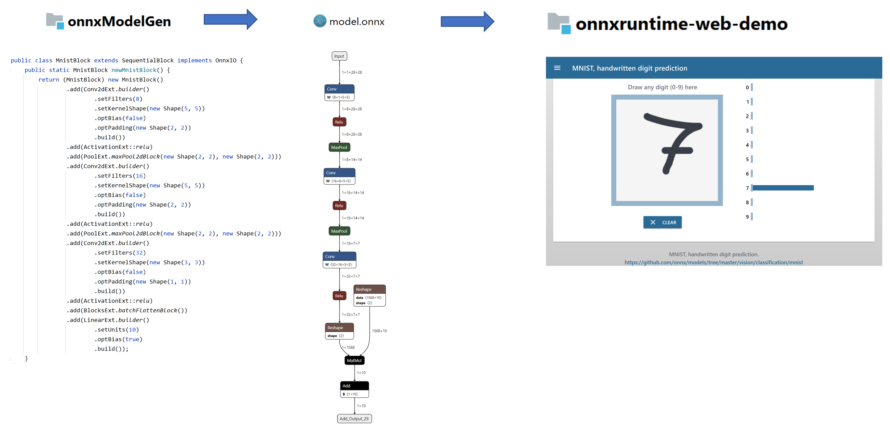

# Brain Dump Example: DJL -> ONNX -> ONNX Runtime Web

Suppose you
* set up a model in DJL (writing Java code only) and trained it with some supported engine (e.g. Pytorch)
* want to load the model into a browser for inference using ONNX Runtime Web.

## Purpose of this project



This is just an example on how to do the ONNX export for a simple MNIST classification model in DJL.

## How?

Let's start with the "hello world" [DJL - MNIST training example](https://github.com/deepjavalibrary/djl/blob/master/jupyter/tutorial/02_train_your_first_model.ipynb).
Use it with a basic model defined with DJL blocks inside the java code ... not one defined elsewhere.

Add an export functionality (non standard, yet) that saves an ONNX model with structure information and learned parameters.

Test the ONNX model by importing it the DLJ standard way for ONNX inference using an ONNX/Pytorch hybrid engine (standard).

Drop the generated ONNX model file into a ready made Vue.js based [ONNX Runtime Web Demo](https://microsoft.github.io/onnxruntime-web-demo/#/mnist).

And it works :-)


## Details on the ONNX export functionality

Many libraries like Pytorch have an out of the box ONNX export functionality. DJL has ONNX support which allows you to run an existing ONNX model for inference.
When you define models within DJL in Java the model nicely can be composed out of hierarchically structured blocks. These blocks may use abstracted functions implemented in the underlying engine (MXnet, Pytorch, ...) together with
Java functions defined within your code. When saving a model from DJL the normal way, the parameters (not the structure) are saved to file.
To our knowledge exporting an ONNX model from this scenario is not supported by now.

Our steps to get it running for the example: 
* Starting point are the protobuffer version 3 schema files defining the [ONNX IR](https://github.com/onnx/onnx/blob/master/docs/IR.md) from ONNX Release, 1.10.2.
* From these schema files we generate Google protobuffer Java files using [Protocol Buffers protobuf maven plugin](https://github.com/os72/protoc-jar-maven-plugin) 
* The translation of structure and parameters is attached to the standard model blocks by naively extending each block ... experts from the DJL community likely know better how to do this nicely.


## Get example running

Three modules separate the tasks:
* **onnxModelGen** (Java): Defines and trains the model in DJL and then exports it to  ```mnist.onnx```
* **onnxWithRuntime** (Java) Tests the model using ONNX/Pytorch hybrid DJL runtime.
* **onnxruntime-web-demo** (Vue.js - Javascript...): Just a copy of [https://github.com/Microsoft/onnxruntime-web-demo](https://github.com/Microsoft/onnxruntime-web-demo) 

Get it running in steps

1. build the Java projects 
```
    mvn clean install
```
2. run **onnxModelGen**
``` 
    java -jar ./onnxModelGen/target/onnxModelGen-1.0-SNAPSHOT-exec.jar
```
3. run **onnxWithRuntime**
``` 
    java -jar ./onnxWithRuntime/target/onnxWithRuntime-1.0-SNAPSHOT-exec.jar
```
4. copy model to webdemo
``` 
    cp ./models/mnist.onnx ./onnxruntime-web-demo/public
```
5. build **onnxruntime-web-demo**
``` 
    cd onnxruntime-web-demo
    npm install
```
6. run **onnxruntime-web-demo**
``` 
    npm run serve
``` 
Open [http://localhost:8080/#/mnist](http://localhost:8080/#/mnist) in a browser and start drawing.
